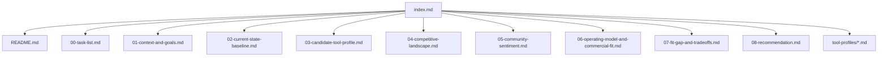

# {Tool Name} Research Index

This document is the main entry point for the full research package.

## Reading Guide

1. Start with the top-level [README](../README.md) for the short verdict.
2. Review [Task List](./00-task-list.md) to see what is complete and what remains.
3. Read the numbered sections below for the full analysis.
4. Review the tool profile pages for deep dives on each tool.
5. Use the appendices for supporting detail and large comparison tables.

## Recommended Reading Order

| File | Purpose |
| --- | --- |
| [../README.md](../README.md) | Executive one-pager and repository landing page |
| [00-task-list.md](./00-task-list.md) | Live checklist showing completed and remaining work |
| [01-context-and-goals.md](./01-context-and-goals.md) | Scope, users, goals, and decision criteria |
| [02-current-state-baseline.md](./02-current-state-baseline.md) | Current tools in use and the baseline to beat |
| [03-candidate-tool-profile.md](./03-candidate-tool-profile.md) | The candidate tool's strengths, gaps, and fit |
| [04-competitive-landscape.md](./04-competitive-landscape.md) | Relevant competitors and market position |
| [05-community-sentiment.md](./05-community-sentiment.md) | What public practitioners are saying, including recurring praise, complaints, and caveats |
| [06-operating-model-and-commercial-fit.md](./06-operating-model-and-commercial-fit.md) | Operating model, adoption friction, and commercial fit when relevant |
| [07-fit-gap-and-tradeoffs.md](./07-fit-gap-and-tradeoffs.md) | Side-by-side tradeoffs and decision factors |
| [08-recommendation.md](./08-recommendation.md) | Final recommendation, confidence, and next steps |

## Tool Profiles

| File | Purpose |
| --- | --- |
| [tool-profiles/{candidate-tool}.md](./tool-profiles/{candidate-tool}.md) | Deep profile of the candidate tool |
| [tool-profiles/{incumbent-tool}.md](./tool-profiles/{incumbent-tool}.md) | Deep profile of a tool already in use |
| [tool-profiles/{competitor-tool}.md](./tool-profiles/{competitor-tool}.md) | Deep profile of a relevant competitor |

## Navigation Diagram

## Executive Summary

{Two to four paragraphs that summarize the recommendation and how to read the package.}
